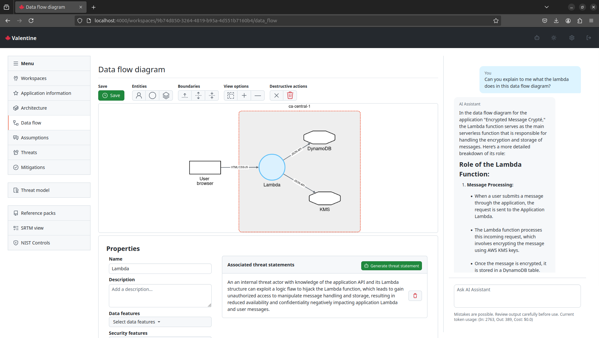

# 🍁 Valentine

Valentine is a real-time collaborative threat modeling tool that combines human expertise with generative AI to streamline the security design process while maintaining simplicity and rigor.



## Features

1. Threat modeling with [STRIDE](https://en.wikipedia.org/wiki/STRIDE_model) based on the [AWS threat grammar](https://catalog.workshops.aws/threatmodel/en-US/what-can-go-wrong/threat-grammar). For more information see the [AWS Threat Composer](https://github.com/awslabs/threat-composer).

2. Collaborative, real-time editing of threat models, data flow diagrams, and application architecture.

3. Generative AI to help assist threat modeling and explain architectures and data flow.

4. Mapping of assumptions and mitigations to NIST controls for easy compliance documentation.

5. Use of shareable reference packs to help establish common assumptions, threats, and mitigation across teams in an organization.

## Rationale

Valentine offers an alternative to the compliance-driven security approach commonly practiced in large organizations. In teams following agile development practices, compliance-driven security often creates a bottleneck: controls must either be determined before development begins or after it concludes. This paradigm positions security as an obstacle to development rather than a collaborative partner in the process.

Valentine is built on the premise that a system's attack surface expands primarily through the addition of features and their interactions. While the most secure system [might be the one that does nothing](https://github.com/kelseyhightower/nocode), real-world applications must balance security with functionality. As new features are implemented or system components evolve, the threat model should adapt to reflect both direct threats from new capabilities and emergent threats from feature interactions, environmental changes, and dependencies.

Threat modeling, particularly the STRIDE methodology, provides teams with an accessible framework for identifying and understanding threats throughout the development lifecycle. Through an iterative process, teams can build and maintain a comprehensive threat model that reflects their system's actual architecture, interactions, and environmental context, rather than relying solely on upfront design assumptions.

While Valentine streamlines the threat modeling process, it recognizes that compliance documentation remains a necessary business requirement. Rather than treating compliance as an afterthought or barrier, a key design goal has been to automatically generate documentation from the ongoing threat modeling process. Teams can map assumptions and mitigations to specific NIST controls, and export the resulting documentation for security assessments, making compliance a natural outcome of good security practices.

Valentine's flexibility allows it to be used for threat modeling both individual features and entire systems, without imposing a rigid workflow on teams. This adaptability enables organizations to integrate security thinking into their development process in a way that suits their specific needs and maturity level.

## Quickstart using codespaces
1. [](https://codespaces.new/maxneuvians/valentine)
2. `make setup`
3. `make dev`

Note: It is normal to see warnings during the setup process. Also depending on the amount of memory available to the codespace, the setup process may take longer than usual.


## Running with docker compose

You can run the app locally using docker compose. It is not recommended to use this in production.

```
docker compose up
```

will build the latest image and run the app on `http://localhost:4000`. If you would like to use the LLM functionality, you need to provide your own OPENAI API key for `gpt-4o-mini`.

```
OPENAI_API_KEY=sk-proj... docker compose up
```

If you make changes to the source code, then you need to rebuild the image: 

```
docker compose up -d --no-deps --build app
```

## Setup for development

```
cd valentine
mix deps.get
mix ecto.create
mix ecto.migrate
mix run priv/repo/seeds.exs
cd assets
npm i 
```

## OpenAI on Azure

You can also use OpenAI on Azure. You need to provide the following environment variables:

```
AZURE_OPENAI_ENDPOINT=
AZURE_OPENAI_KEY=
```

## Optional Google Auth

You can use Google as your IDP if you set the following environment variables:

```
GOOGLE_CLIENT_ID=your-client-id
GOOGLE_CLIENT_SECRET=your-client-secret
```

You can get these by creating a new project in the Google Developer Console and creating OAuth 2.0 credentials.

In this case to access the `/workspaces` route you need to be authenticated with Google, but visiting `/auth/google`. Currently nothing is done with the user information from Google, but you can use it to restrict access to the app.

## Dev issues with formatting

https://github.com/elixir-lsp/elixir-ls/issues/1110