# Gallery

### Dashboard for a workspace
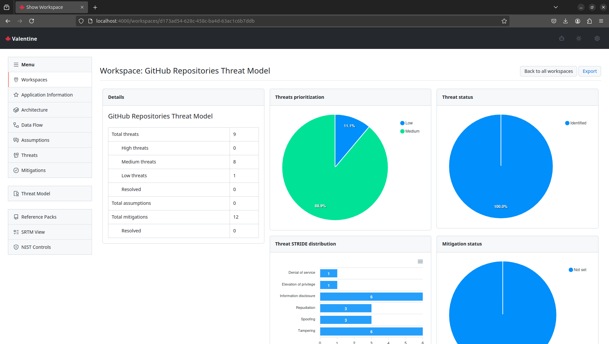

### Workspace application information
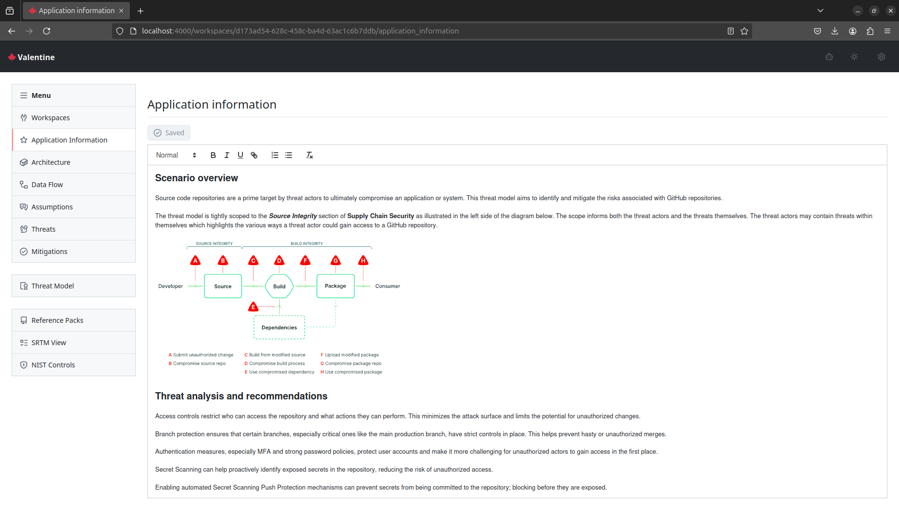

### Workspace architecture
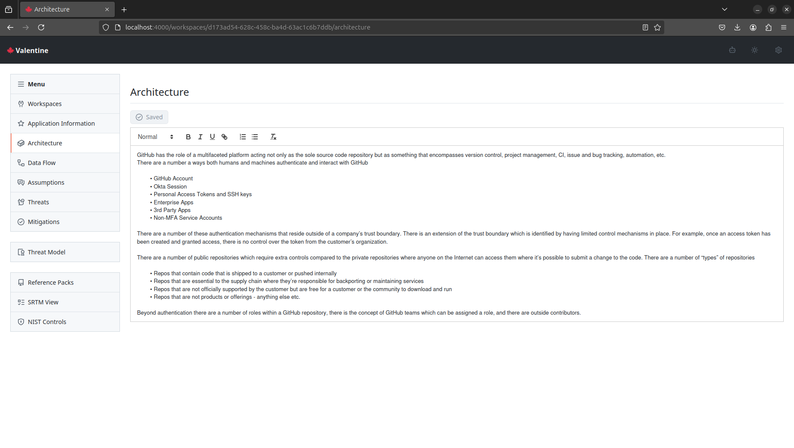

### Data flow diagram for a workspace
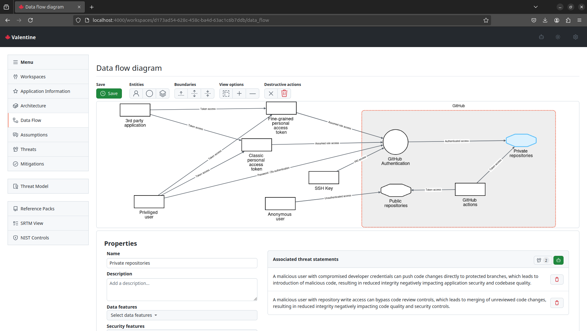

### Empty assumptions for a workspace
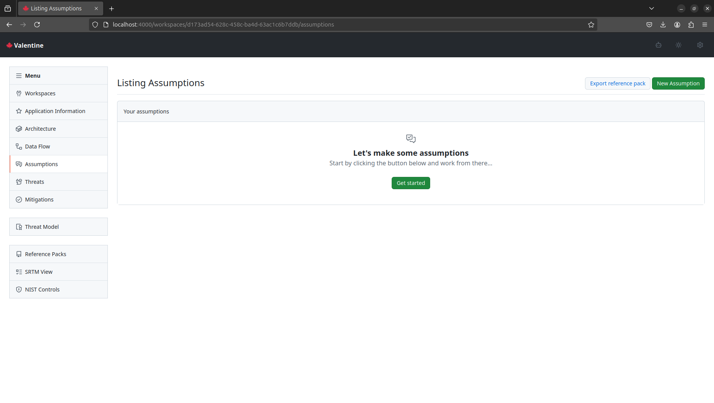

### List of threats for a workspace
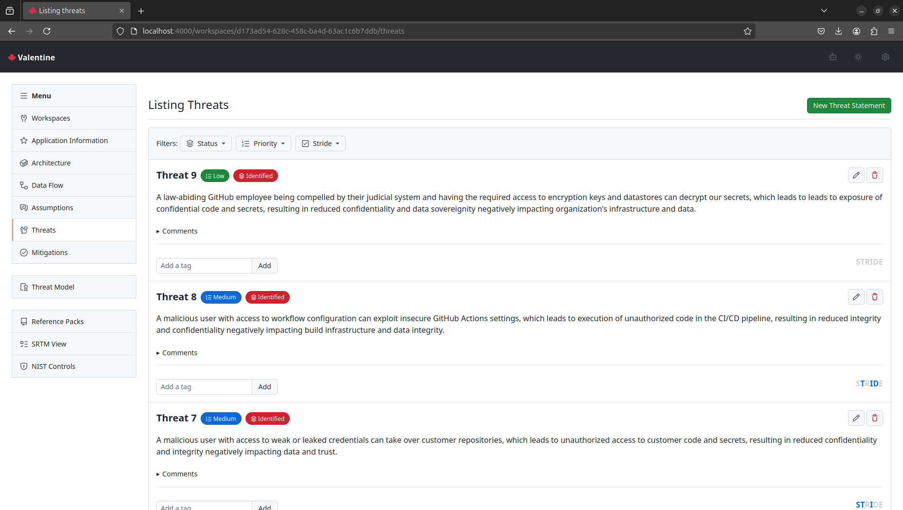

### New threat statement for a workspace
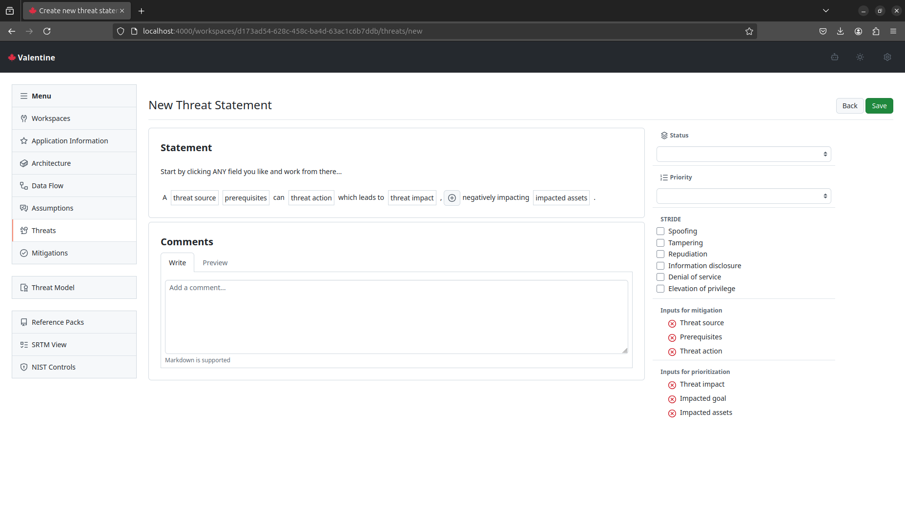

### Edit threat statement for a workspace
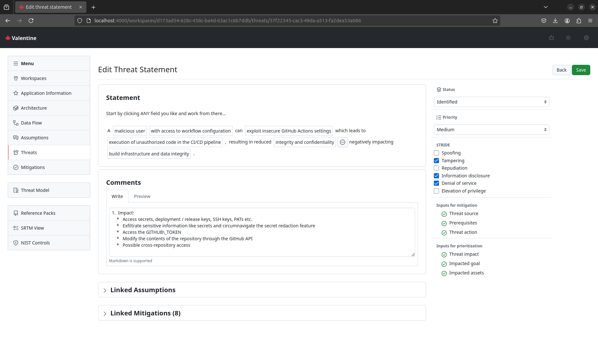

### List of mitigations for a workspace
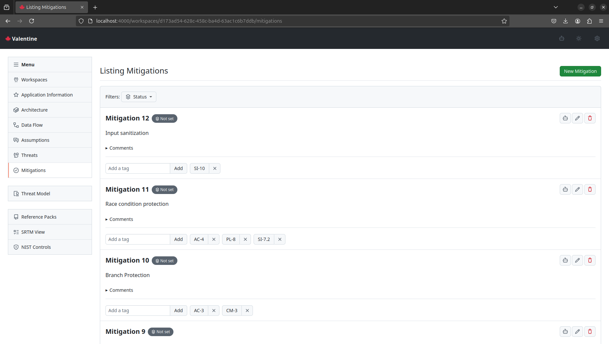

### Tagging a mitigation for a workspace
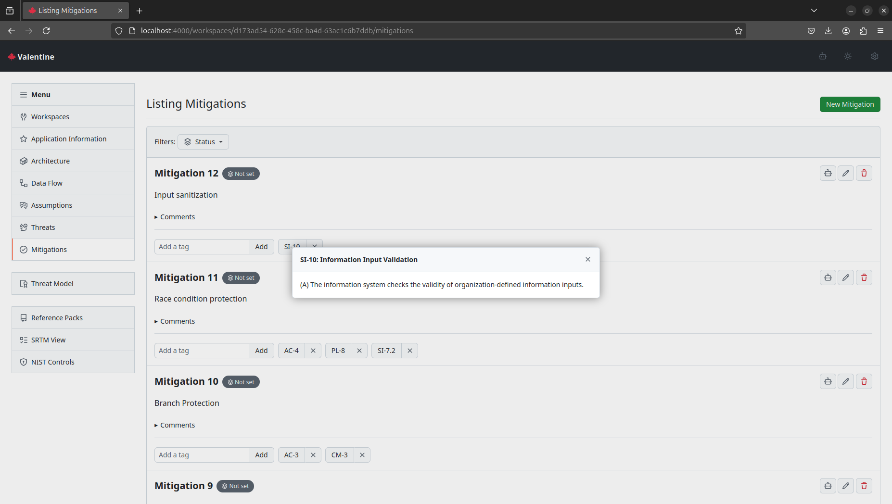

### Threat model report for a workspace
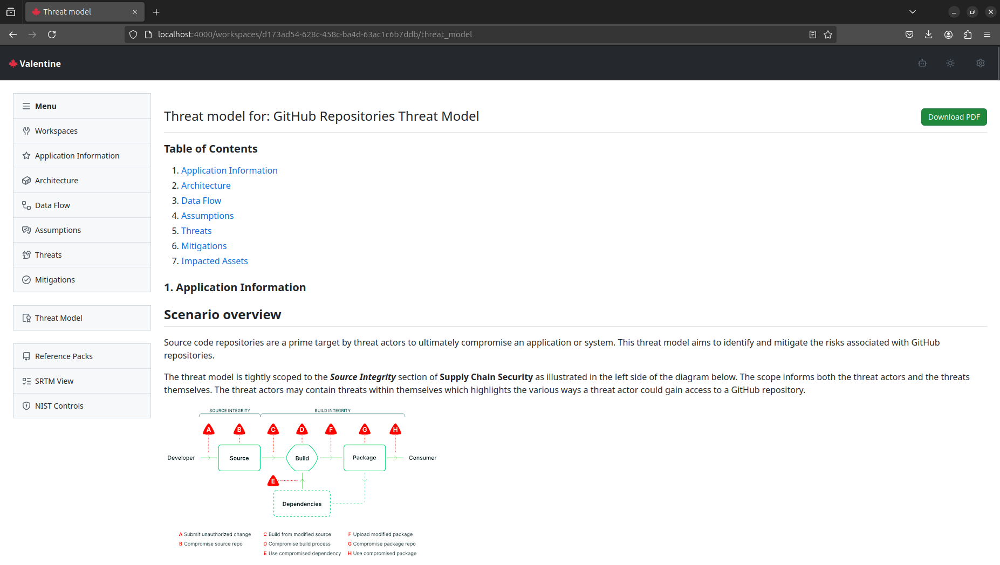

### Reference packs for a workspace
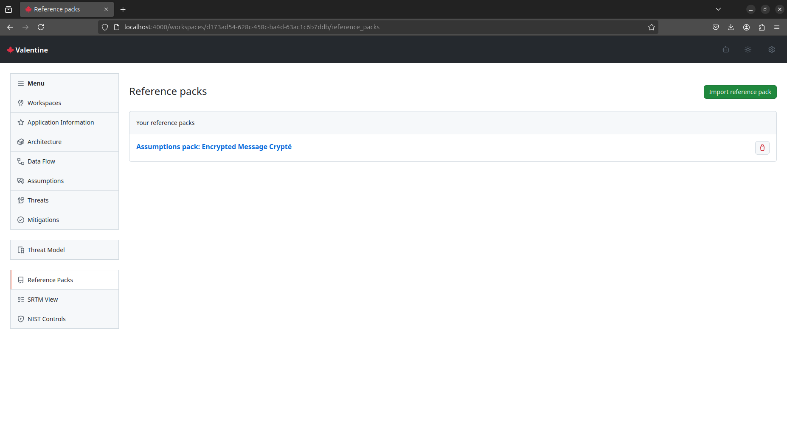

### Reference pack details for a workspace
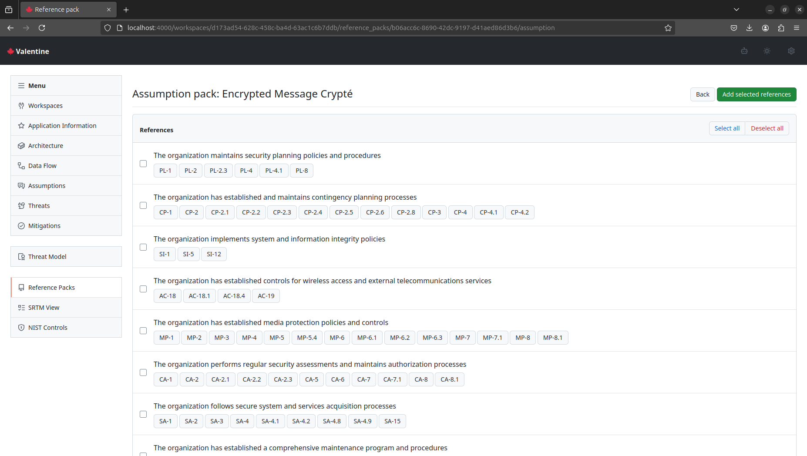

### SRTM for a workspace
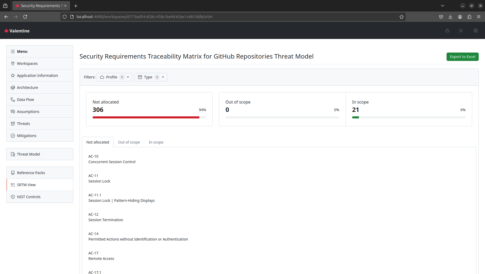

### NIST Control reference page
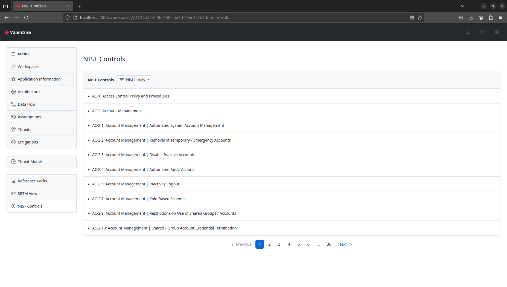